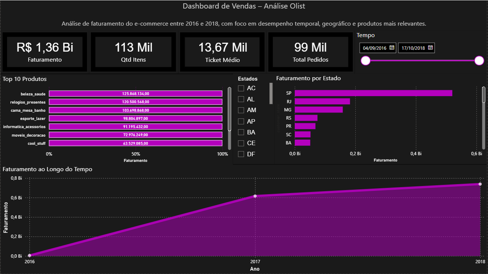

# 📊 Dashboard de Vendas – Power BI

Projeto de análise de dados utilizando Power BI com foco em indicadores de vendas.

## 📌 Métricas analisadas
- Faturamento
- Total de pedidos
- Quantidade de itens
- Ticket médio

## 📊 Visualizações
- Faturamento ao longo do tempo
- Faturamento por estado
- Top 10 produtos

## 🛠️ Ferramentas utilizadas
- Power BI
- DAX
- Modelagem de dados

## 📷 Dashboard

